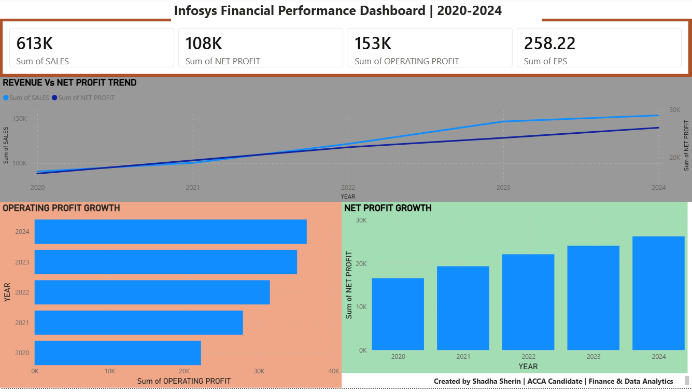
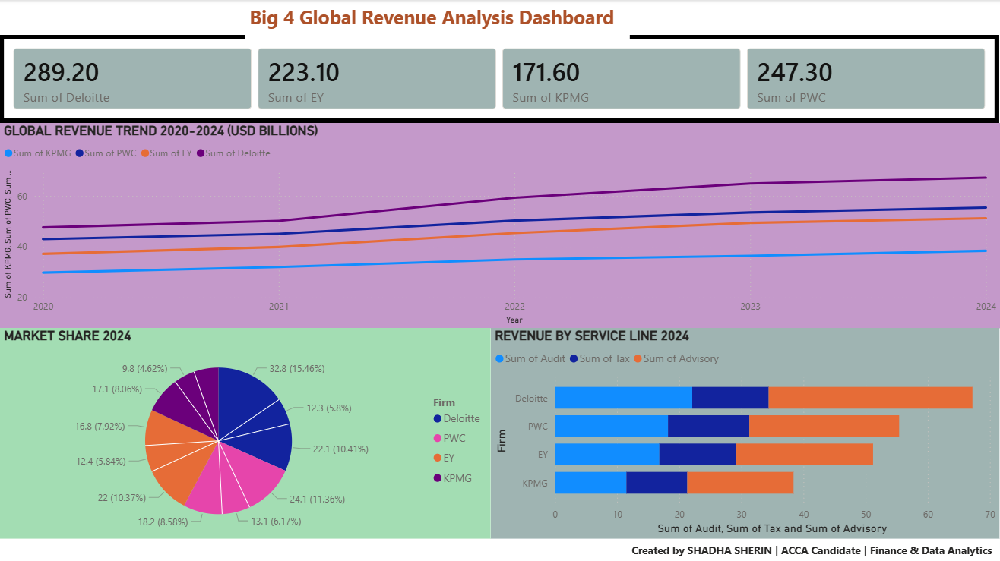
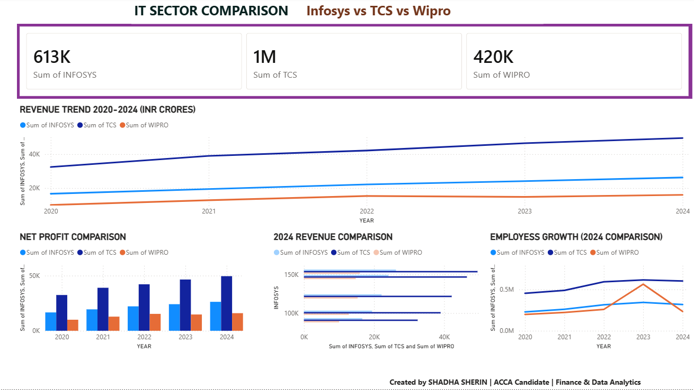
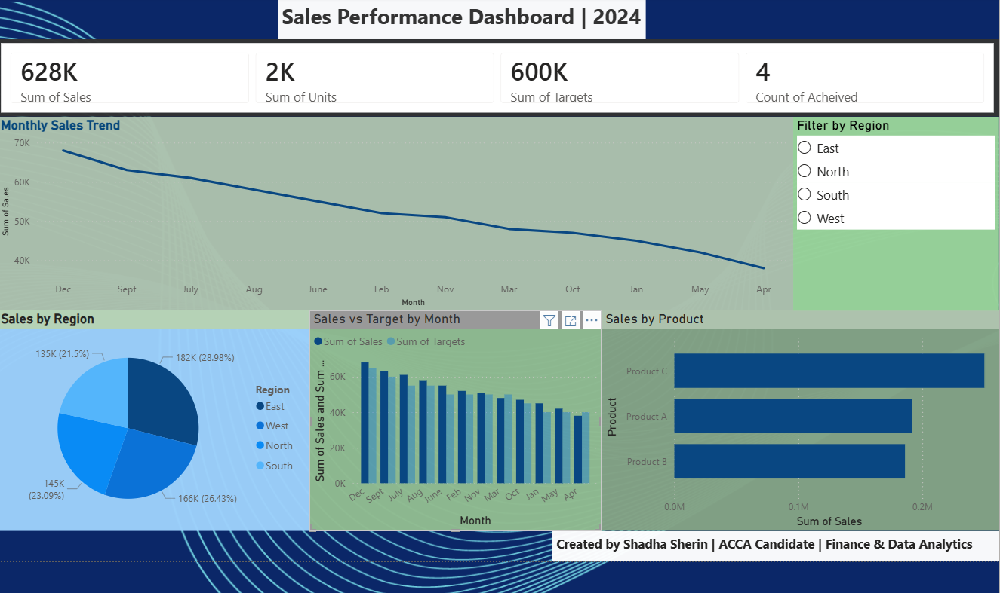
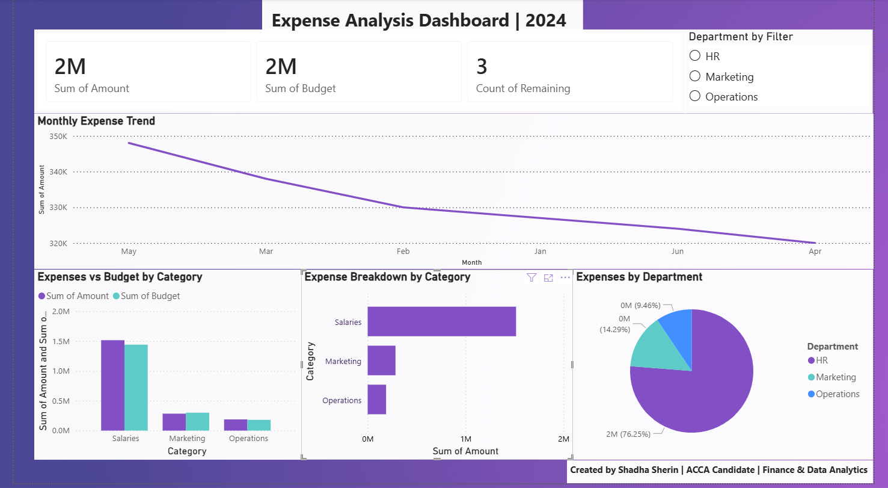
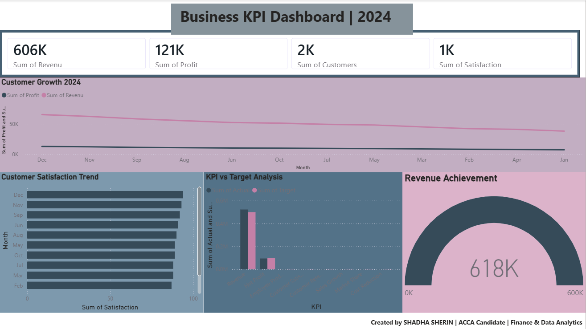
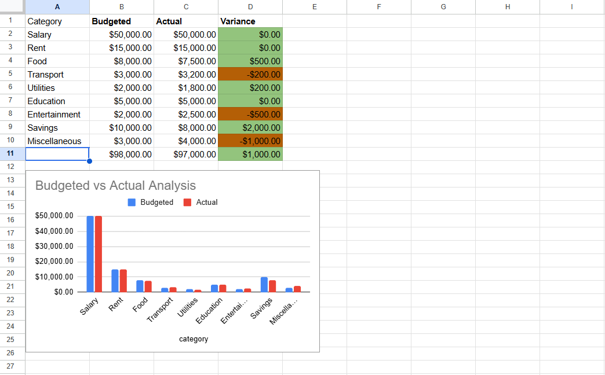
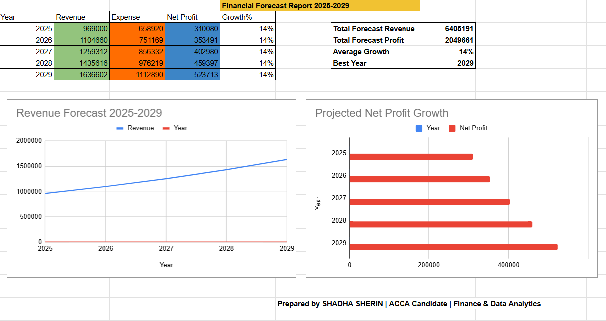

# 💼 Finance Analytics Portfolio
### Shadha Sherin | ACCA Candidate | Finance & Data Analytics

---

## 👩‍💼 About Me

Finance Graduate and ACCA Candidate with expertise in financial analysis, data visualization, and business intelligence. I combine accounting knowledge with data analytics to deliver professional financial dashboards and reports.

- 🎓 BCom Graduate — Pondicherry University
- 📊 ACCA Candidate — 8 Papers Completed
- 💼 Virtual Experience: PwC | EY | Fidelity Investments
- 🌍 Open to Remote Opportunities

---

## 📊 Projects

### 1. Infosys Financial Performance Dashboard

- 📌 5-year financial analysis of Infosys Ltd
- 🛠️ Tools: Power BI, Excel, DAX
- 📈 KPIs: Revenue, Net Profit, EPS, Operating Profit
- 🔗 [View File](Infosys_Dashboard.p.pbip)

---

### 2. Big 4 Global Revenue Analysis Dashboard

- 📌 Comparison of Deloitte, PwC, EY, KPMG (2020-2024)
- 🛠️ Tools: Power BI, Excel, DAX
- 📈 KPIs: Global Revenue, Market Share, Service Lines
- 🔗 [View File](Big4_Revenue_Dashboards.pbip)

---

### 3. IT Sector Comparison Dashboard

- 📌 Infosys vs TCS vs Wipro comparison
- 🛠️ Tools: Power BI, Excel, DAX
- 📈 KPIs: Revenue, Net Profit, Employee Growth
- 🔗 [View File](IT_Sector_Dashboard.pbip)

---

### 4. Sales Performance Dashboard

- 📌 Regional and product sales analysis
- 🛠️ Tools: Power BI, Excel, DAX
- 📈 KPIs: Sales, Units, Targets, Regional Performance
- 🔗 [View File](Sales_Dashboard.pbix)

---

### 5. Expense Analysis Dashboard

- 📌 Department-wise expense tracking
- 🛠️ Tools: Power BI, Excel, DAX
- 📈 KPIs: Total Expenses, Budget vs Actual, Department Analysis
- 🔗 [View File](Expense_Analysis.pbix)

---

### 6. Business KPI Dashboard

- 📌 Complete business performance metrics
- 🛠️ Tools: Power BI, Excel, DAX
- 📈 KPIs: Revenue, Profit, Customer Growth, Satisfaction
- 🔗 [View File](Business_KPI_Dashboard.pbix)

---

### 7. Personal Budget Tracker

- 📌 Automated budget vs actual tracker
- 🛠️ Tools: Google Sheets, Excel
- 📈 Features: Variance analysis, color coding, charts
- 🔗 [View Live Sheet](https://docs.google.com/spreadsheets/d/1fpVp2OH-YPPC-Q-McDocbLPVnal3i5bpmwjBSRzOyco/edit?usp=sharing)

---

### 8. Financial Forecasting Model

- 📌 5-year revenue forecast with historical analysis
- 🛠️ Tools: Google Sheets, Excel, Financial Modeling
- 📈 Features: Automated formulas, Growth projections
- 🔗 [View File](Financial_Forecast.xlsx)

## 🛠️ Skills

| Category | Skills |
|----------|--------|
| Finance | Financial Reporting, Auditing, Tax, Budgeting |
| Analytics | Power BI, DAX, Data Visualization |
| Tools | Excel, Google Sheets, Tally, QuickBooks |
| Certifications | ACCA, Microsoft Dynamics 365 |
| Learning | Python, SQL, AI Automation |

---

## 📬 Contact

- 💼 LinkedIn: [linkedin.com/in/sherin77](https://linkedin.com/in/sherin77)
- 📧 Email: shadhasherin77@gmail.com
- 🌍 Location: India | Open to Remote & Ireland Opportunities
