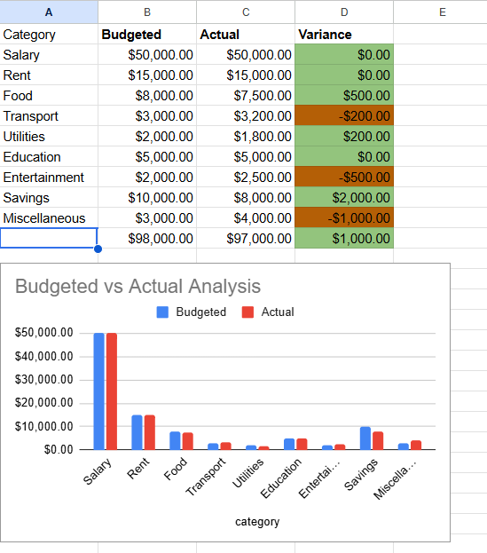

# Finance Analytics Portfolio
### Shadha Sherin | ACCA Candidate | Finance & Data Analytics Professional

Welcome to my portfolio! Here, I showcase automated financial models, interactive business intelligence dashboards, and data-driven solutions tailored for modern corporate finance, audit, and tax environments.

---

## 📊 Projects

### 1. Automated Personal Budget Tracker & KPI Dashboard
A dynamic financial tracker built in Google Sheets/Excel featuring automated variance logic, financial currency formatting, and an interactive budget-vs-actual visual analysis dashboard.
* 🛠️ **Tools Used:** Google Sheets, Conditional Logic, Dynamic Charts, Financial Modeling
* 📊 **Visual Preview:**

* 🔗 [Click here to interact with the Live Google Sheet Template](https://docs.google.com/spreadsheets/d/1fpVp2OH-YPPC-Q-McDocbLPVnal3i5bpmwjBSRzOyco/edit?usp=sharing)

### 2. Infosys Financial Performance Dashboard
An in-depth corporate financial analysis model evaluating revenue growth patterns, profitability ratios, and operational health metrics.
* 🛠️ **Tools Used:** Power BI, Financial Analysis, Corporate Reporting
* 🔗 [Click here to view this project dashboard/files](Infosys_Dashboard.p.pbip)

### 3. Big 4 Global Revenue Analysis Dashboard
A macro-level dashboard tracking and comparing revenue streams, regional performance, and growth trajectory across top-tier accounting and advisory environments.
* 🛠️ **Tools Used:** Power BI, Revenue Modeling, Regional Performance Tracking
* 🔗 [Click here to view this project dashboard/files](Big4_Revenue_Dashboards.pbip)
### 4. IT Sector Comparison Dashboard
A comprehensive benchmarking model evaluating and comparing key financial indicators, overhead ratios, and profit margins across major IT service firms.
* 🛠️ **Tools Used:** Financial Analysis, Trend Analytics, Data Visualization
* 🔗 [Click here to view this project dashboard/files](PASTE_YOUR_IT_SECTOR_LINK_HERE)

---

## 💡 Technical Skills & Core Competencies

### 🎯 Finance, Accounting & Audit
* **Financial Modeling & Forecasting:** Building dynamic, scalable budget and forecasting templates to drive business decisions.
* **Variance & Performance Management:** Analyzing budget-vs-actual metrics to track operational spend and revenue trends.
* **Core Accounting & Payroll:** Extensive practical background managing vendor payments, bank reconciliations, payroll, and inventory functions.
* **Compliance & Audit Quality:** Strong academic and professional foundation in international financial reporting, tax, and core auditing principles.

### 💻 Data Analytics & Technology
* **Advanced Excel & Google Sheets:** Master of pivot tables, complex logical functions (`XLOOKUP`, `INDEX/MATCH`, `IFS`), conditional formatting layouts, and data cleanup.
* **Business Intelligence (Power BI):** Transforming complex transactional datasets into clean, executive-ready KPI dashboards and interactive visuals.
* **Python for Finance (Learning in Progress):** Transitioning toward programming to automate repetitive accounting workflows, data ingestion, and full-dataset audit scripting.

---

## 📬 Contact & Connect
* **LinkedIn:** [linkedin.com/in/sherin77](https://linkedin.com/in/sherin77)
* **Email:** shadhasherin77@gmail.com
